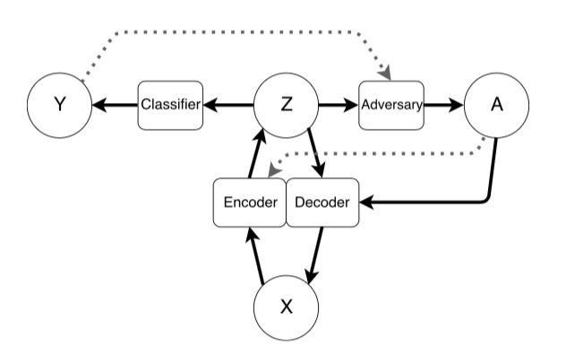

#### Investigating fair classification in facial recognition systems using adversarially learned fair representations

**MSc Dissertation Progress report**

s1791387 - Viraat Aryabumi

#### Goal
- Train and test an adversarial learning method for obtaining a fair representations of facial images.
- Compare these results to baseline methods which are:
  - No adversarial training
  - Remove features which are correlated with the sensitive attribute
- Extended goal: check the transferrability of these representations, i.e. given a completely new image from a different data set can we obtain a fair representation.

#### Methods

##### Architecture  

*The Adversarial Learning architecture proposed by Madras et. al.*
- Madras et. al use Neural Networks to implement all parts of the architecture.
- For choosing an encoder there are various options
  - Neural network based
      - Triplet networks (FaceNet)
      - Siamese networks (VGG Face)
  - Classical computer vision based embeddings
      - Kernel methods
- For the classifier and the adversary any classifier can be used. The following are considered:
  - SVM
  - Neural networks
- Currently, the decoder is not being implemented. Time permitting it would be interesting to see how the images which are reproduced from the fair representations.
- While the loss functions for the other parts of the system are relatively straightforward, for the the adversary a fairness metric is used as an objective. Given the nature of the dataset (equal number of men and women) it would be useful to use demographic parity as a metric. Alternatively, equalized odds can also be used.

#### Implementation details  
- PyTorch (version 0.4) is used as the core framework to build and train the models.

##### Challenges faced
- Full dataset unavailable due to images being taken down/HTTP 403 responses.  
  - Solution: redownloading from multiple computers, scrambling the order of downloads to prevent 403 responses
- Access to GPU cluster has been unreliable for the past few weeks
  - Solution: Using $300 of google cloud credit, apply classical CV methods for feature extraction, applying for extra credits given to MSc students
- DICE/AFS being unavailable due to power failure/heating issues.
  - Solution: Store dataset on personal laptop as well as gcloud storage.

#### Work accomplished (and remaining work)

##### Choices
- [x] Encoder: FaceNet using inception-v3 architecture and triplet loss
- [x] Classifier and adversary: fully connected Neural Networks  
- [x] Adversary objective: equalized odds

##### Model building
- [x] Dataset downloaded
  - Approx 35,000 images of male actors and 33,000 images of female actors
  - 265 male and 265 female actor in total
  - 53 male and 53 female actors are held out for validation and testing
- [x] Code for loading and augmenting the data
  - Horizontal augmentation
  - Rotation
  - Normalization
- [x] Code for Inception architecture, triplet network and Triplet loss
- [ ] Training the baseline without any adversary learning
  - [x] Training under way. Various issues in getting access to compute.
- [ ] Removal of correlated features and comparing performance
- [ ] Code for adversarial Training
  - [x] Incorporating adversarial loss

##### Literature review - Structure
- Overview of fairness in ML
  - [x] importance and impact
  - [x] fairness metrics
  - [ ] pre and post processing methods
  - [ ] fair representations
- Face recognition
  - [ ] Classical Methods
  - [x] Deep learning based Methods
  - [x] Motivation for fairness  
        - Sokolic et. al 2016
- Adversarial Training
  - [ ] General Overview
  - [ ] Adversarial training for fairness  
      -  Edwards and Storkey 2015  
      -  Zhang et al 2018  
      -  Madras et al 2018  
